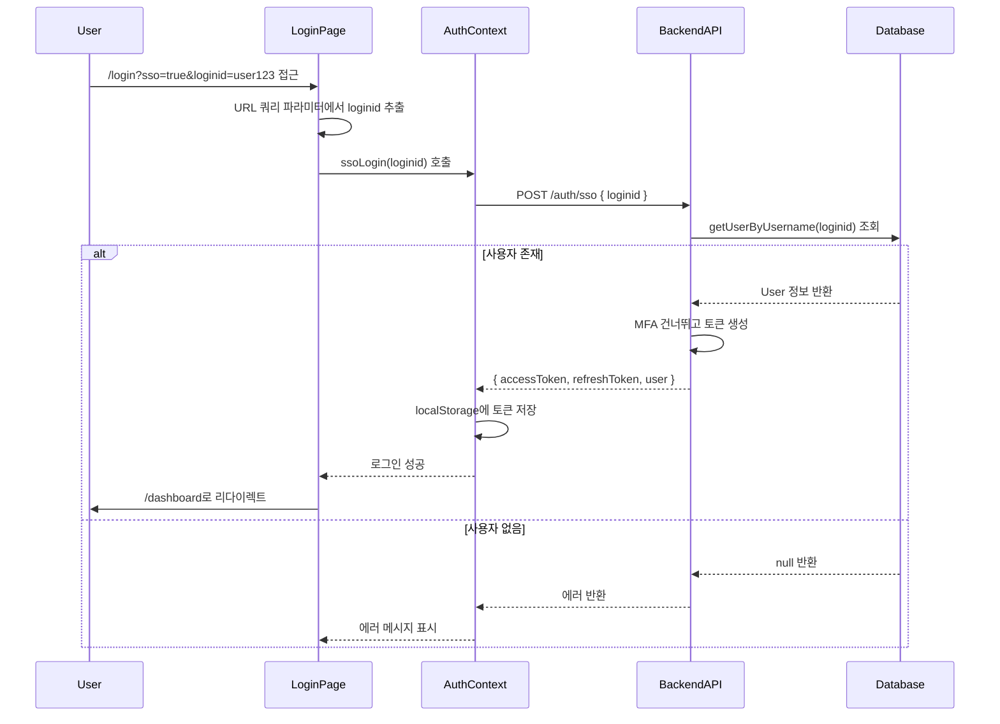

# SSO 로그인 구현 계획

## 개요

EpTray에서 SSO 인증을 완료한 사용자의 `loginid`를 URL 쿼리 파라미터로 받아와서 사용자 정보를 조회하고 로그인하는 기능을 구현합니다.

## 구현 흐름

## 구현 작업

### 1. 백엔드: SSO 로그인 서비스 함수 추가

**파일**: `services/core-service/src/modules/auth/services/authService.ts`

- `ssoLogin(loginid: string)` 함수 추가
  - `getUserByUsername(loginid)`로 사용자 조회
  - 사용자가 없으면 에러 throw
  - 계정 상태 확인 (active 여부)
  - MFA를 건너뛰고 바로 `generateTokensForUser(user)` 호출하여 토큰 생성
  - `LoginResponse` 반환

### 2. 백엔드: SSO 로그인 API 라우트 추가

**파일**: `services/core-service/src/modules/auth/routes/auth.ts`

- `POST /auth/sso` 엔드포인트 추가
  - 요청 body에서 `loginid` 추출
  - `ssoLogin(loginid)` 호출
  - 성공 시 토큰과 사용자 정보 반환
  - 실패 시 적절한 에러 응답

### 3. 프론트엔드: AuthContext의 ssoLogin 함수 수정

**파일**: `src/contexts/AuthContext.tsx`

- `ssoLogin` 함수를 `ssoLogin(loginid: string)` 형태로 수정
  - `loginid`를 파라미터로 받도록 변경
  - `authApi.post('/sso', { loginid })` 호출
  - 응답에서 토큰과 사용자 정보 추출하여 localStorage에 저장
  - AuthState 업데이트

### 4. 프론트엔드: 로그인 페이지에서 SSO 처리

**파일**: `src/app/[locale]/login/page.tsx`

- `useEffect`로 URL 쿼리 파라미터 확인
  - `sso=true` 및 `loginid` 파라미터가 있으면 자동으로 SSO 로그인 시도
  - 로딩 상태 표시
- `handleSSO` 함수 수정
  - URL에서 `loginid` 추출 또는 사용자 입력 받기
  - `ssoLogin(loginid)` 호출
- SSO 로그인 버튼 클릭 시
  - 개발 환경에서는 임시로 `loginid` 입력 받거나
  - 실제 EpTray 연동 시에는 쿼리 파라미터에서 자동으로 읽어오기

## 주요 변경 사항

### 백엔드

1. **authService.ts**: `ssoLogin` 함수 추가
2. **auth.ts (routes)**: `POST /auth/sso` 라우트 추가

### 프론트엔드

1. **AuthContext.tsx**: `ssoLogin` 함수 시그니처 변경 (loginid 파라미터 추가)
2. **login/page.tsx**: URL 쿼리 파라미터 처리 및 자동 SSO 로그인 로직 추가

## 에러 처리

- 사용자가 데이터베이스에 없을 경우: "사용자를 찾을 수 없습니다" 에러 메시지
- 계정이 비활성화된 경우: "계정이 비활성화되었습니다" 에러 메시지
- 네트워크 오류: 일반적인 네트워크 에러 메시지

## 테스트 시나리오

1. 정상 케이스: `/login?sso=true&loginid=existing_user` 접근 시 자동 로그인
2. 사용자 없음: 존재하지 않는 loginid로 접근 시 에러 표시
3. 비활성 계정: 비활성화된 사용자로 접근 시 에러 표시
4. 수동 SSO 버튼: SSO 로그인 버튼 클릭 시 (개발 환경에서 테스트용)